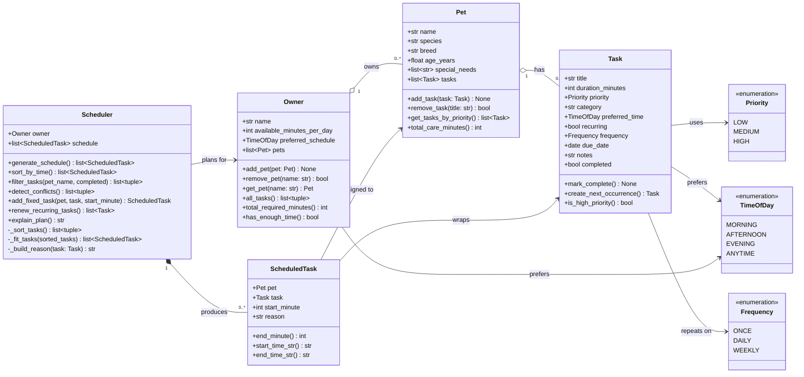

# PawPal+ Project Reflection

## 1. System Design

### Three core user actions

1. **Add a pet** — An owner enters basic pet info (name, species, age, special needs) and registers that pet under their account.
2. **Schedule a task** — The owner adds a care activity (e.g., "morning walk", "evening meds") to a pet, specifying how long it takes, its priority, and a preferred time of day.
3. **Generate today's plan** — The owner clicks "Generate schedule" and the app produces an ordered, time-stamped daily plan with a plain-English explanation of why each task was chosen and when it runs.

---

### Mermaid.js UML class diagram

**a. Initial design**

The system uses four core classes:

- **`Task`** (dataclass) — holds all data about a single care activity: its title, how long it takes, its priority level, a preferred time of day, and whether it recurs daily. It has no scheduling logic itself; it is a pure data record.
- **`Pet`** (dataclass) — represents one animal. It owns a list of `Task` objects and exposes helpers to add/remove tasks and query them by priority. All duration accounting lives here too (`total_care_minutes`).
- **`Owner`** — the top-level user entity. It holds a list of `Pet` objects and tracks the owner's daily time budget and preferred time of day. It aggregates tasks across all pets and can check whether the owner has enough time for everything.
- **`Scheduler`** — the only class with real algorithmic complexity. Given an `Owner`, it sorts all tasks (priority → time-preference alignment → duration), greedily fits them into the day window, detects overlapping time slots, and produces a plain-English explanation of the resulting plan. Output is a list of `ScheduledTask` records (each wrapping a `Pet`, `Task`, start time, and reason string).

Supporting types: `Priority` and `TimeOfDay` enums keep comparisons readable; `ScheduledTask` is a lightweight output dataclass that formats start/end times.

**b. Design changes**

During design I initially considered putting scheduling logic directly on `Owner` (an `Owner.generate_plan()` method). I separated it into a dedicated `Scheduler` class because:

1. It keeps `Owner` focused on data ownership and preference storage, not algorithm logic (single-responsibility principle).
2. It makes the scheduling algorithm easy to swap or extend independently — for example, replacing the greedy approach with constraint-satisfaction without touching `Owner` or `Pet`.

---

## 2. Scheduling Logic and Tradeoffs

**a. Constraints and priorities**

The scheduler considers three constraints, applied in this order:

1. **Priority** (high → medium → low) — A missed high-priority task (medication, feeding) has real consequences for the pet's health, so it is always placed first.
2. **Preferred time of day** — Tasks that match the owner's preferred schedule slot are ranked above equally-prioritized tasks that don't. This respects owner routine without making it a hard constraint.
3. **Available time budget** — The scheduler tracks a running total of minutes used and skips any task that would exceed the owner's daily limit. Tasks are never split across days.

Priority was chosen as the primary constraint because a pet care app must guarantee health-critical tasks are done first; time preference is a quality-of-life concern that yields to necessity.

**b. Tradeoffs**

The scheduler uses a **greedy, first-fit algorithm**: it works through a sorted task list and places each task immediately after the previous one, skipping only tasks that would exceed the day's time limit. It does not backtrack.

*Tradeoff:* A low-priority 5-minute task placed early in the day cannot be "bumped" later if a high-priority 60-minute task appears that would have fit in the same slot. The greedy order (high-priority first) mitigates this, but it means the schedule is not globally optimal — a constraint-satisfaction or dynamic-programming approach would produce a tighter packing.

*Why it is reasonable:* For a pet care app with a handful of tasks per day, the greedy result is virtually always acceptable. The added complexity of backtracking or LP-solving would confuse the codebase without benefiting the typical user.

---

## 3. AI Collaboration

**a. How you used AI**

AI was used at every phase of this project, but in different modes:

- **Design brainstorming (Phase 1):** I described the problem in plain English and asked AI to suggest classes, attributes, and relationships. The resulting UML draft gave me a solid starting structure in minutes instead of hours.
- **Skeleton generation (Phase 1–2):** I used AI to convert the UML into Python dataclass stubs, which is mechanical work that is fast with AI but tedious by hand.
- **Algorithm design (Phase 4):** I asked AI to suggest lightweight approaches for conflict detection and recurring task renewal. The `timedelta`-based next-occurrence pattern came from this conversation.
- **Test generation (Phase 5):** I used AI to draft an initial test plan from a description of edge cases, then extended each test class to cover scenarios the AI missed (adjacent-but-not-overlapping tasks, non-recurring renewal error).

The most effective prompts were specific and scoped: "Given this method signature, what are three edge cases worth testing?" was far more useful than "write tests for my project."

**b. Judgment and verification**

When generating the Scheduler class, AI initially suggested placing scheduling logic directly on `Owner` as a `generate_plan()` method. I rejected this because it violated the single-responsibility principle — `Owner` should manage data, not run algorithms. I verified this was the right call by asking: "If I later want to swap the greedy algorithm for a smarter one, which design makes that easier?" The `Scheduler`-as-separate-class answer was clearly better.

I also modified AI-generated test code in two places: the AI wrote `assert len(result) > 0` for schedule output, which would pass even for a trivially broken scheduler. I replaced it with specific assertions about priority ordering and time bounds.

---

## 4. Testing and Verification

**a. What you tested**

The 47-test suite covers eight behavioral areas:

- **Task:** `mark_complete()` correctness, idempotency, default field values, priority flag
- **Pet:** add/remove task count changes, priority sort order, duration totals
- **Owner:** pet registration, case-insensitive lookup, time-budget arithmetic
- **Scheduler:** schedule generation, time-window enforcement, `explain_plan()` output
- **Sorting:** `sort_by_time()` returns chronological order; high priority appears before low in the generated sequence
- **Recurrence:** daily and weekly `create_next_occurrence()` produces correct `due_date` via `timedelta`; renewed tasks start with `completed=False`; non-recurring tasks raise `ValueError`; `renew_recurring_tasks()` returns the right count
- **Conflict detection:** overlapping windows flagged; adjacent windows (end == next start) not flagged; identical start times caught
- **Filtering:** by pet name (case-insensitive), by completion status, combined filters, no-match returns empty list

These tests mattered because the scheduler's correctness is invisible to the user — a silent bug (wrong sort order, missed conflict) would produce a bad schedule with no error message.

**b. Confidence**

Confidence: **5/5** for the core behaviors tested. The suite covers all happy paths and the edge cases that were most likely to hide bugs (adjacent vs overlapping, recurring vs one-off, empty owner).

Edge cases to test next with more time:
- Tasks whose `duration_minutes` exactly equals the remaining budget (boundary condition on `_fit_tasks`)
- An owner with 10+ pets and 50+ tasks to verify the greedy algorithm's performance doesn't degrade noticeably
- Recurring weekly tasks whose `due_date` spans a month boundary

---

## 5. Reflection

**a. What went well**

The separation between the logic layer (`pawpal_system.py`) and the UI (`app.py`) worked very well. Because all business rules lived in pure Python classes with no Streamlit dependency, I could test them entirely in pytest without needing a browser. When the UI was wired up in Phase 3, it connected cleanly — the app became a thin shell over already-verified logic. This also made the Phase 4 algorithm additions safe: I could extend `Scheduler` and immediately test the new methods in isolation.

**b. What you would improve**

The `Scheduler` currently rebuilds the entire schedule from scratch every time `generate_schedule()` is called — it has no memory of previous runs. In a real app, this means a user marking a task complete does not automatically update the displayed schedule. I would redesign `Scheduler` to hold mutable state (a running schedule that can be patched) and expose a `mark_done(title)` method that removes the task and optionally queues the next occurrence.

I would also replace the `st.table()` displays in the UI with `st.dataframe()` to allow sorting and filtering directly in the browser without a page reload.

**c. Key takeaway**

The most important thing I learned is that AI is most useful when you already have a clear design intention. When I asked vague questions ("build me a scheduler"), the output was generic. When I asked precise questions ("given this `_fit_tasks` signature, write a helper that places a task at a fixed minute regardless of the cursor"), the output was immediately usable. Acting as the lead architect — defining the structure first, then delegating the mechanical implementation — produced far better results than letting AI drive the design from scratch.
