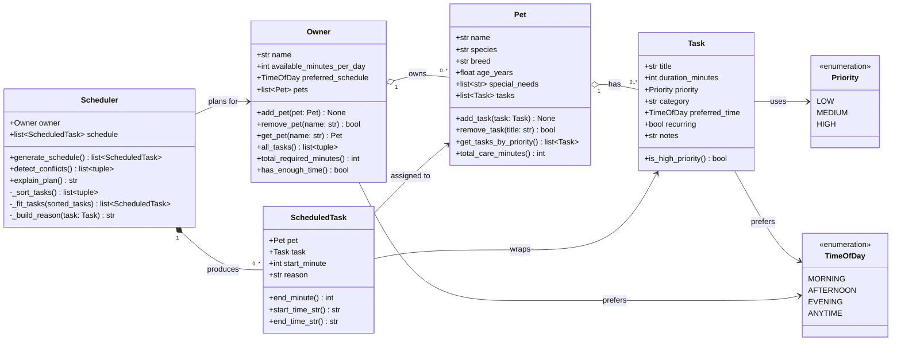

# PawPal+ Project Reflection

## 1. System Design

### Three core user actions

1. **Add a pet** — An owner enters basic pet info (name, species, age, special needs) and registers that pet under their account.
2. **Schedule a task** — The owner adds a care activity (e.g., "morning walk", "evening meds") to a pet, specifying how long it takes, its priority, and a preferred time of day.
3. **Generate today's plan** — The owner clicks "Generate schedule" and the app produces an ordered, time-stamped daily plan with a plain-English explanation of why each task was chosen and when it runs.

---

### Mermaid.js UML class diagram

**a. Initial design**

The system uses four core classes:

- **`Task`** (dataclass) — holds all data about a single care activity: its title, how long it takes, its priority level, a preferred time of day, and whether it recurs daily. It has no scheduling logic itself; it is a pure data record.
- **`Pet`** (dataclass) — represents one animal. It owns a list of `Task` objects and exposes helpers to add/remove tasks and query them by priority. All duration accounting lives here too (`total_care_minutes`).
- **`Owner`** — the top-level user entity. It holds a list of `Pet` objects and tracks the owner's daily time budget and preferred time of day. It aggregates tasks across all pets and can check whether the owner has enough time for everything.
- **`Scheduler`** — the only class with real algorithmic complexity. Given an `Owner`, it sorts all tasks (priority → time-preference alignment → duration), greedily fits them into the day window, detects overlapping time slots, and produces a plain-English explanation of the resulting plan. Output is a list of `ScheduledTask` records (each wrapping a `Pet`, `Task`, start time, and reason string).

Supporting types: `Priority` and `TimeOfDay` enums keep comparisons readable; `ScheduledTask` is a lightweight output dataclass that formats start/end times.

**b. Design changes**

During design I initially considered putting scheduling logic directly on `Owner` (an `Owner.generate_plan()` method). I separated it into a dedicated `Scheduler` class because:

1. It keeps `Owner` focused on data ownership and preference storage, not algorithm logic (single-responsibility principle).
2. It makes the scheduling algorithm easy to swap or extend independently — for example, replacing the greedy approach with constraint-satisfaction without touching `Owner` or `Pet`.

---

## 2. Scheduling Logic and Tradeoffs

**a. Constraints and priorities**

- What constraints does your scheduler consider (for example: time, priority, preferences)?
- How did you decide which constraints mattered most?

**b. Tradeoffs**

- Describe one tradeoff your scheduler makes.
- Why is that tradeoff reasonable for this scenario?

---

## 3. AI Collaboration

**a. How you used AI**

- How did you use AI tools during this project (for example: design brainstorming, debugging, refactoring)?
- What kinds of prompts or questions were most helpful?

**b. Judgment and verification**

- Describe one moment where you did not accept an AI suggestion as-is.
- How did you evaluate or verify what the AI suggested?

---

## 4. Testing and Verification

**a. What you tested**

- What behaviors did you test?
- Why were these tests important?

**b. Confidence**

- How confident are you that your scheduler works correctly?
- What edge cases would you test next if you had more time?

---

## 5. Reflection

**a. What went well**

- What part of this project are you most satisfied with?

**b. What you would improve**

- If you had another iteration, what would you improve or redesign?

**c. Key takeaway**

- What is one important thing you learned about designing systems or working with AI on this project?
